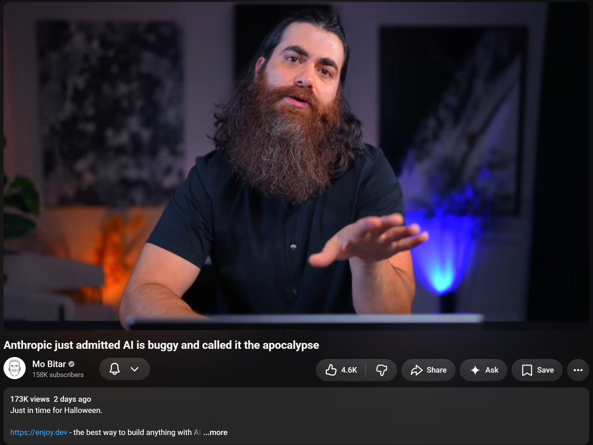
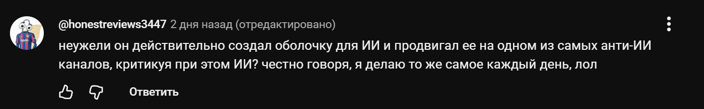
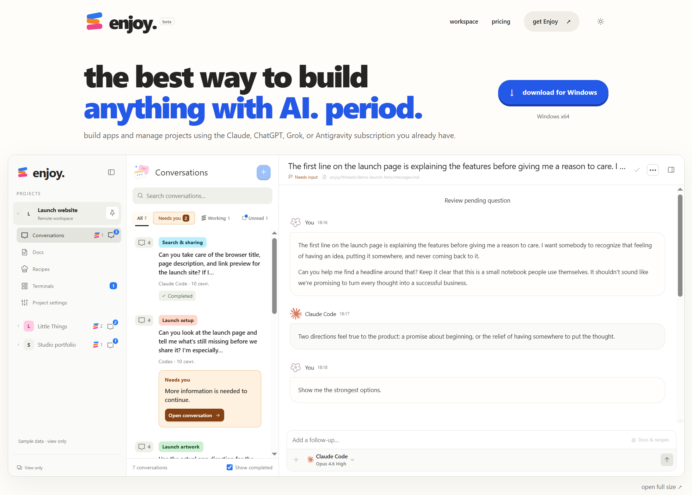

# Ботинки отрицателей ИИ
### 18.09.2026 Turborium(c)

  
Есть такой чел с ютуба "Mo Bitar", который год страдал ИИ отрицанием, и хайпанул именно из-за этой байды, про "ИИ никогда не сможет ххх".  
Но начал рассматривать социальные проблемы из-за ИИ, в том числе потерю рабочих мест в IT, по мере принятия реальности.  
  
Щас переобулся и вещает про то, что "ИИ это просто хуевый инструмент". (менее радикальный подвид отрицалова)  
  
Ну - переобулся и хуй бы с ним, так?  
  
Но не, ахахах, он как и любой "мега отрицатель ИИ" высрал свой ИИ SAAS, аля, "создавай хуйню через ИИ, не умея программировать", и продает его.  
  
Блять - какие же все эти отрицатели - говноеды.   
  
Сначала отрицают, кормят надеждой на IT будущее своих зрил, а потом продают хуйню которая этих зрил и заменяет.  
  
В комментариях у некоторых пригар.  
А я не понимаю -  как можно было это жрать и не понимать, что тупо кормят копиумом?  
  
Запомните - практически любой чел, что кормит копиумом, просто инструментом, или "низаменят", по итогу будет продавать вам помойные ИИ SAAS.  
  
<https://www.youtube.com/watch?v=fz-mRRaJJ94>

---

Самое смешное, что он в этом ролике снова скатился к тому, что ИИ это просто автодополнение кода, только теперь работающее.  
  
Блядь, я не понимаю, типа, уверен, он бы свой ИИ SAAS сервис никогда бы не написал сам ручками.  
Думаю, что он тяжелее джейсона, в жизни, не держал в своих руках ничего.  
Мы не видели его код ни разу, ток нытье про то, что ИИ это полная хуйня, которая не работает и никогда не будет работать.  
Где его проекты до ИИ «автодополнения»?   
  
Это видео вообще смешное, чувак говорит, что ИИ - супер говно, хуево работает, и тут же «я сделал охуенный ИИ инструмент,  позволяет создавать программы тем, кто не умеет программировать, покупайте».  
  
Такое ощущение, что некоторые тупо не способны «2 + 2» сложить.  

---

Вообще, если я восхищаюсь ИИ проектами - то восхищаюсь тому, какой стал крутой ИИ, а не «стараниям создателей».  
  
Тип, я достаточно тыкал ИИ и отлично понимаю, что «крутость = количество токенов», а не мега старания, если проект на 100% написан ИИ.  
  
Челы все не понимают - что всем пох на их 100% ИИ параши.  
Блять - ну тип какая разница мне Лупа или Пупа «сделал» мега ИИ проект, молодец тут ИИ модель. Она реально крутая, да.  
  
Единственная заслуга челов, на таких проектах, это умение упаковать и продать. Поэтому без финансовых отчетов восхищаться нечему.  
  
А вся эта байда про мега промты сверху и мега спецификации, это тоже самое, что хуйня про мега паттерны разработки и т.д. Ее не измерить никак.  
  
Что можно было измерить раньше - это качество кода, архитектуру, и функционал. Теперь это делает ИИ.   
Мерить нечего, кроме количества потраченных токенов. Ну иногда еще реально крутая идея, можно ее оценить, если это не очередной «очень уникальный ИИ SAAS».  
  
Поэтому ИИ модели - крутые да, а челы что ввели «мега промт» и получили готовый проект - ну тип, ну мне рил похуй, были бы бабки бесконечные - сам бы ввел.  
