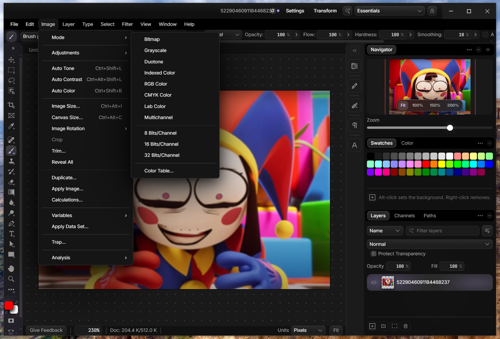
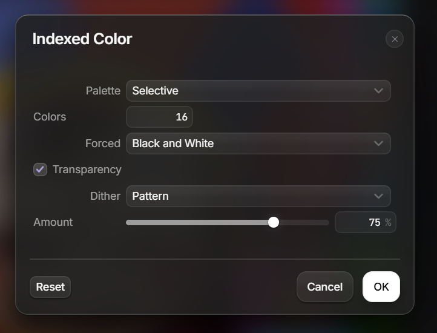
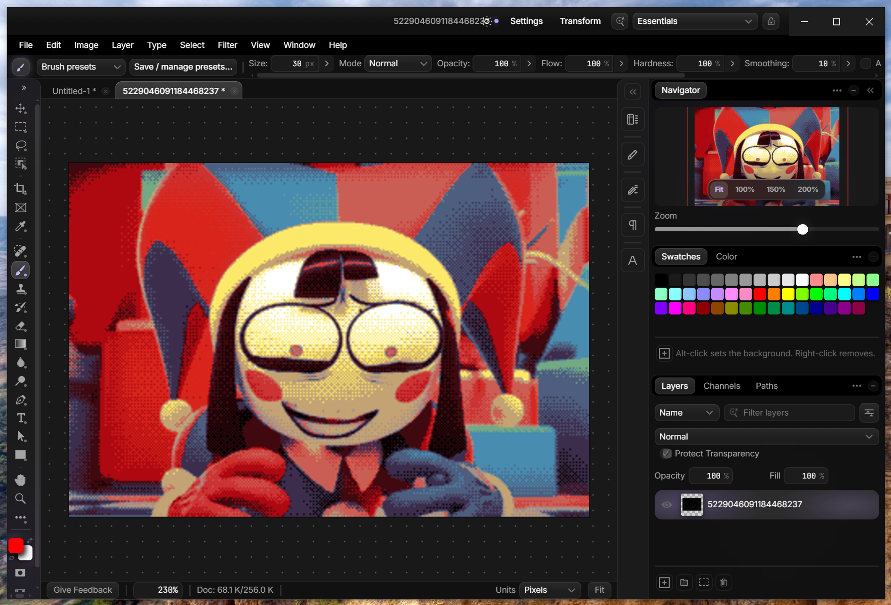
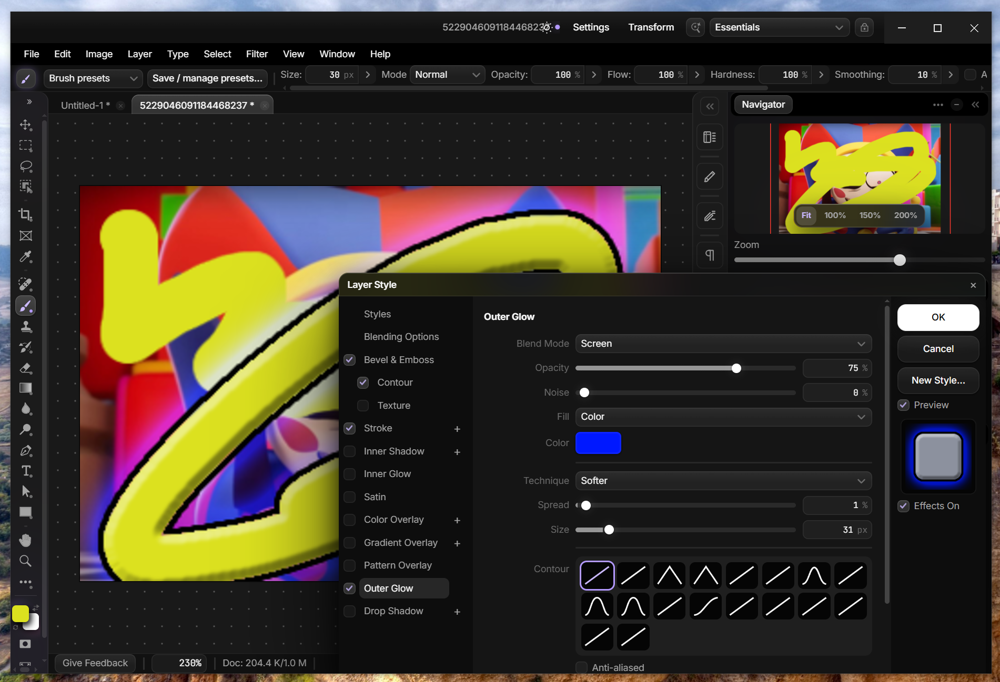
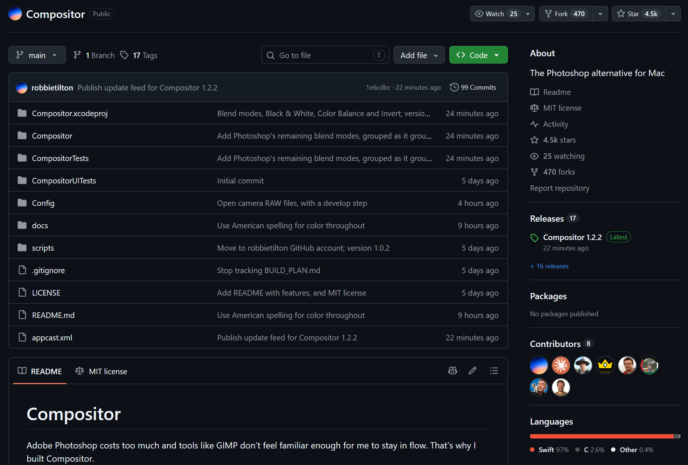

# Фотошоп за $2000
### 18.09.2026 Turborium(c)

<video src="https://turborium.github.io/blog/res/99-1.webm.mp4" width="800" controls></video>
  
Я давно мечтал, что однажды напишу свою кроссплатформенную UI библиотеку, скриптовый ЯП, и на основе этого сделаю свой простенький аналог фотошопа.  
Чтож. Больше не мечтаю.  
  
Какой-то чел, по фану, зарядил $2000 в GPT Astra, и попросил клонировать фотошоп.  
Что модель и сделала.  
  
Я запустил, и да, функционала - дохуя, даже инструмент дизеринга 1 в 1, как в фотошопе, и он работает, пусть и хуже.  
Хз, насколько оно забагованное, но не думаю, что эт все важно, концептуально.  
Очевидно - баги есть - но ИИ их пофиксит если еще бабла зарядить.  

  
  
  
  
  
Есть факт того, что ИИ, с полпинка, за $2000 написала эту сложную софтину.  
  
[https://habr.com/ru/posts/1083196/](https://habr.com/ru/posts/1083196/)  
  
—  
При этом видео-презентацию чел сделал своим другим, завайбкоженым, софтом: [https://tenzen.studio/](https://tenzen.studio/)  
  
—  
Почему я эт запостил? Ну, это пример обычного чела, а не кейс от ИИ контор. Пример показательный.  
Все что надо теперь - это бабло.  
  
Так что все - примите реальность, победить ИИ, в программировании, вы уже не сможете, как не старайтесь.  
  
Бабло = Уровень.  
  
Это конец.  

---

A представляете, что до сих пор есть челы, которые такие "РЯЯЯЯЯЯЯЯЯЯЯ, ЭТО НЕ ИИ, ЭТО ПРОСТО КОПИПАСТА!!! Т9!!! ПРОСТО ИНСТРУМЕНТ!!!".  Ахахахахаххахахаха.  
  
(На скриншотах выше - мое лицо с этого).  
  
Если вы еще не догнали - такой проект - это уровень, который, почти каждый галерный сеньер не осилит, никогда.   
ДУМАЕМ.  

---

<video src="https://turborium.github.io/blog/res/99-6.mp4" width="800" controls></video>
Ну и на добивочку - сравним как работает выбор цвета в GIMP, который написан людьми на сишечке-писечке, и в этом ИИ фотошопе, который написан на JS.  

"Копипаста" победила сишников выходит.  

---

Ахахахаха, а есть же еще челы, которые сейчас сидят без работы, и пишут в комментариях под статьями и роликами с доминацией ИИ, хуйню аля «ща ща ща, ИИ пузырь лопнет, токены подорожают, снова программистов, пишущих код руками, нанимать начнут».  
Или «ща ща ща наделают говна через ИИ, и за огромные бабки наймут обратно всех, ИИ слоп фиксить».  

---

<video src="https://turborium.github.io/blog/res/99-7.webm" width="800" controls></video>  
  
Пять дней, пять дней, и неизвестное количество токенов, потребовалось бывшему дизайнеру из Google и Apple, чтобы "создать" свой аналог фотошопа, на языке Swift, с нативным OSX интерфейсом.   

«Решение имеет высокий уровень оптимизации, установщик приложения для Mac весит всего 8 МБ, а сам проект сделан так, чтобы не нагружать систему.»  
[https://habr.com/ru/news/1084464/](https://habr.com/ru/news/1084464/)  

—  

Как видите, написание программы уровня фотошопа - стало сродни написанию игры "змейка", главное бабло на токены иметь.  
Т.е. это уже не про "фронтирные задачи для фронтирных ИИ моделей в лабораториях", а про "пет-проект на выходные"(аля поход в казино/игра в гольф - не дешевое развлечение для крутых дядь).  

—  

Оцените, кста, кол-во звезд и форков - всем очевидно, что это ИИ-слоп, а форки сделали, много, ибо чел известный. А вот ценности именно "человеческого" - ее нет видимо, а вы все "душа, душа" - да нет никой души.  
